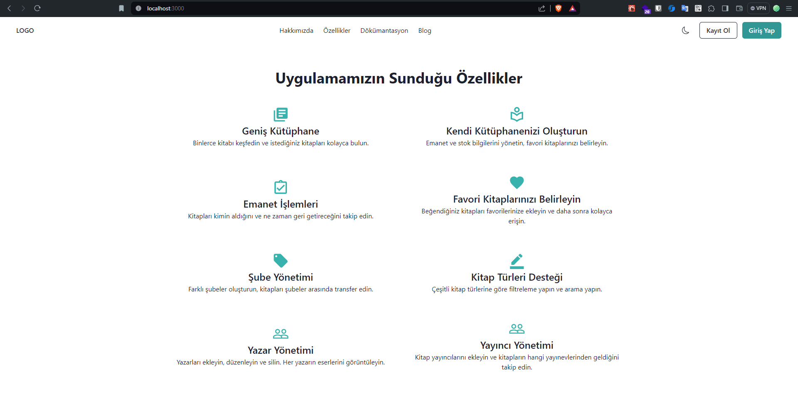
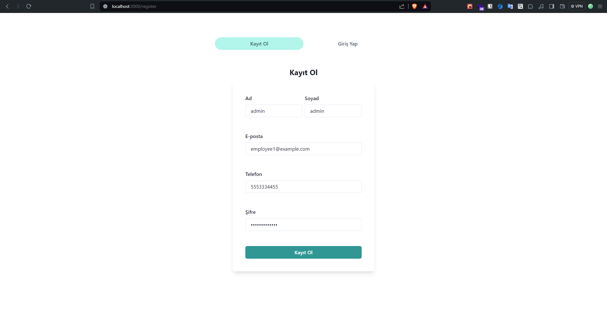
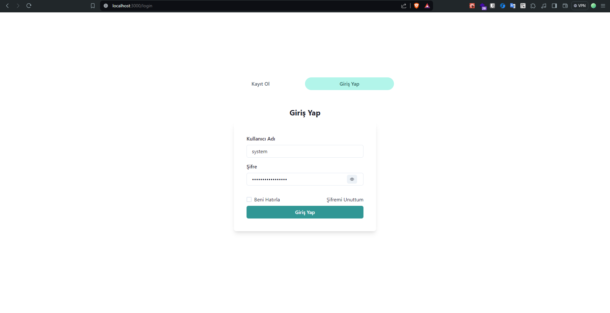
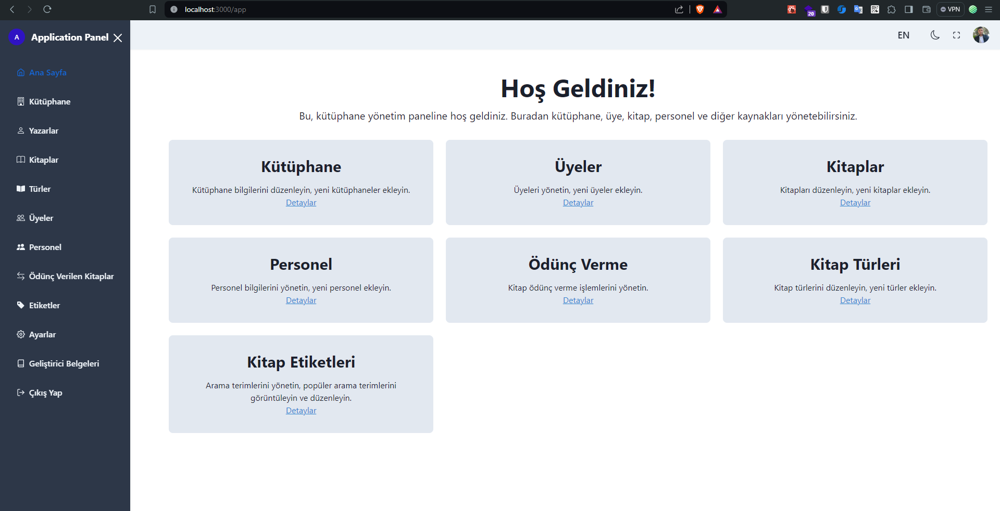
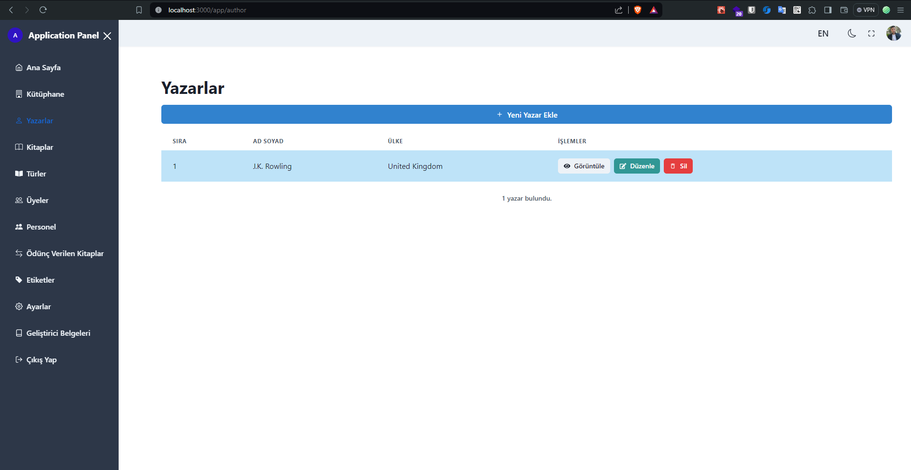
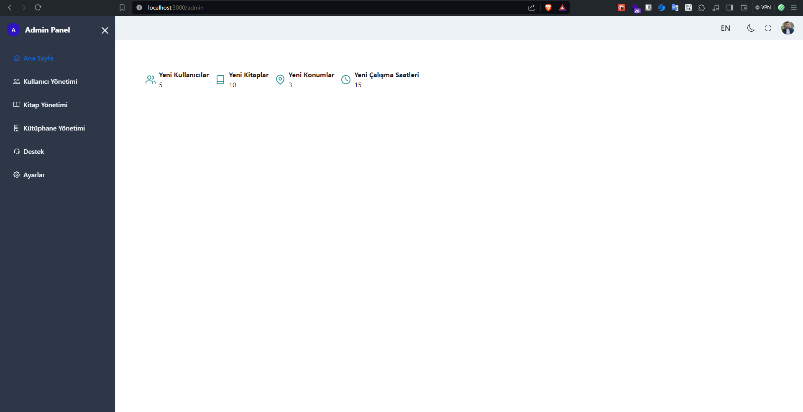
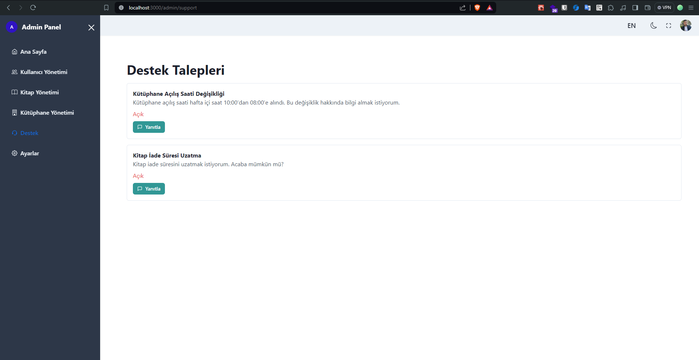
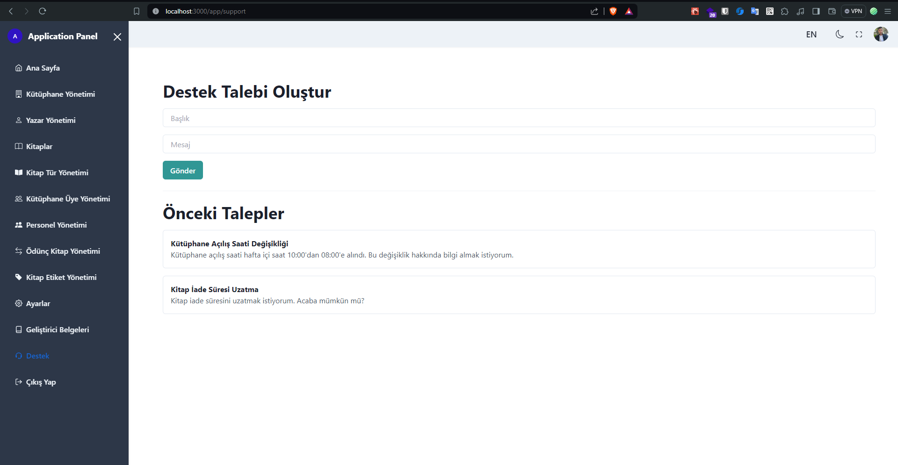
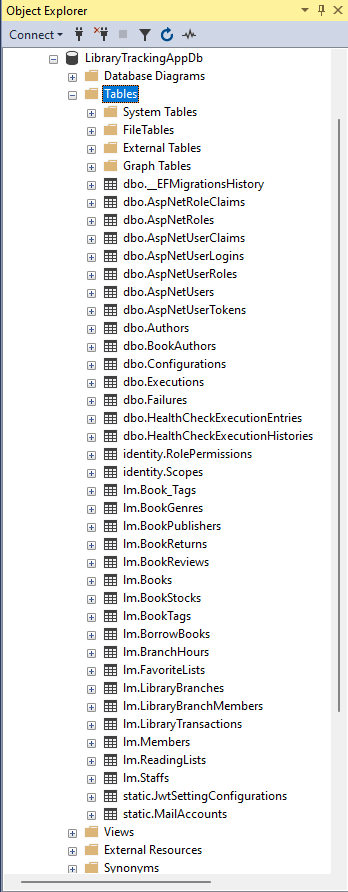

# Kütüphane Takip Uygulaması

Bu API, kapsamlı bir kütüphane takip uygulaması için geliştirilmiş bir dizi özellik sunmaktadır. Kullanıcıların kitapları yönetmelerine, ödünç almalarına, iade etmelerine ve kütüphane içi işlemleri takip etmelerine olanak tanırken, personel için de yönetim ve yetkilendirme araçları sunmaktadır. İşte API'nın temel özellikleri:

## Proje Yapısı ve Mimari

Projenin dosya yapısı ve kullanılan mimari hakkında detaylı bilgiler için [bu bağlantıya](docs/1.0.0/onion-architecture-ve-mediatR.md) göz atabilirsiniz.

**Not:** Projeye ait detaylı belgeler [docs](docs) klasörü içinde bulunmaktadır.

## Özellikler

- **Kitap ve Kategori Yönetimi**: Kitapların ve kategorilerin kaydedilmesi, düzenlenmesi ve sorgulanması.
- **Üye Yönetimi**: Kütüphane üyelerinin kaydedilmesi ve takibi.
- **Ödünç Alma ve İade İşlemleri**: Kitap ödünç alma, iade etme ve süre uzatma işlemleri.
- **Personel Yönetimi**: Kütüphane personelinin yönetimi ve yetkilendirilmesi.
- **Kütüphane İşlemleri Takibi**: Kütüphane içi işlemlerin detaylı kaydı ve raporlanması.
- **Yönetim ve Raporlama Araçları**: Kapsamlı yönetim ve raporlama araçları.
- **Kullanıcı Hesapları ve İzinler**: Çok kullanıcılı hesap yönetimi ve rol bazlı erişim kontrolleri.

## Giriş Paneli ve Kullanıcı Desteği

Kütüphane üyeleri için özel bir giriş paneli bulunmaktadır. Bu panel aracılığıyla kullanıcılar, kitap ödünç alma, iade etme, süre uzatma gibi işlemleri gerçekleştirebilirler. Ayrıca, kullanıcılar admin'e destek için talep açabilirler.

## Kütüphane Yönetimi ve Kitap Eklemesi

Kullanıcılar, kütüphane yöneticileri tarafından belirlenen yetkilendirmeler doğrultusunda kitap ekleyebilir, düzenleyebilir ve silebilirler. Ayrıca, kitap türleri ve dilleri gibi özelliklerle kitapları filtreleyebilirler.

## Kullanıcı-Kitap Etkileşimi

Kullanıcılar, kütüphaneden kitap aldıklarında veya iade ettiklerinde, ilgili kişiye mesaj gönderebilirler. Ayrıca, süre uzatma talebinde bulunabilir veya admin'e destek talebi açabilirler.

## Bildirimler

API, email ve sms gibi yöntemlerle kullanıcılara bildirimler gönderebilir. Örneğin, kitap iadesi yaklaştığında veya süre uzatma talebi onaylandığında kullanıcıya bildirim gönderilebilir.

## Gelişmiş Özellikler

Kütüphane üyeleri, öğrenci veya yetişkin gibi belirlenen tiplerle yönetilmektedir. Ayrıca, kitapların formatlarına (basılı, elektronik, sesli) ve dillerine göre filtreleme yapılabilmektedir.

Bu API, kütüphane yönetimi için gerekli olan tüm işlevleri sağlayarak, modern ve kullanıcı dostu bir kütüphane deneyimi sunar.

<p align="center">
    <a href="https://docs.microsoft.com/en-us/dotnet/csharp/" target="_blank"> 
        
    </a>
    <a href="https://dotnet.microsoft.com/" target="_blank"> 
        
    </a>
    <a href="https://www.microsoft.com/en-us/sql-server" target="_blank" rel="noreferrer"> 
        
    </a>
    <a href="https://react.dev/" target="_blank"> 
        
    </a>
    <a href="https://www.learn-js.org/" target="_blank">
        
    </a>
    <a href="https://nextjs.org/" target="_blank">
        
    </a>
    <a href="https://v2.chakra-ui.com/" target="_blank">
        
    </a>
</p>

Uygulamanın Senaryosu hakkında bilgi için [tıklayınız.](/docs/1.0.0/application-scenario.md)

## Fundamentals

Bu Uygulama, aşağıdaki temel bileşenleri ve kütüphaneleri kullanarak güçlendirilmiştir:

### `Backend`

> - **Microsoft SQL Server**: Veritabanı yönetimi için kullanılır.
> - **Entity Framework 8.0**: Veritabanı işlemlerini yönetmek ve ORM (Object-Relational Mapping) sağlamak için kullanılır.
> - **Onion Architecture**: Katmanlı mimari yaklaşımıyla yazılmıştır, kodun modüler ve bakımı kolay olmasını sağlar.
> - **CQRS Pattern**: Komut ve sorgu sorumluluklarını ayrı ayrı ele alarak daha iyi performans ve ölçeklenebilirlik sağlar.
> - **Generic Repository Pattern**: Veritabanı işlemlerini genelleştirilmiş bir şekilde ele alır, tekrar kullanımı ve bakımı kolaylaştırır.
> - **Generic UnitOfWork Pattern**: Birim işlemlerinin genelleştirilmiş bir şekilde yönetilmesini sağlar.
> - **State Design Pattern **:Kitapların ödünç verilme ve iade durumlarını yönetmek için kullanılan pattern.
> - **Mediator Design Pattern **: Merkezi bir aracı (mediator) kullanarak nesneler arasındaki doğrudan bağımlılığı azaltır.
> - **Mediatr Library**: CQRS ve Mediator desenlerini uygulamak için kullanılır, komut ve isteklerin işlenmesini kolaylaştırır.
> - **FluentValidation Library**: Giriş doğrulaması için kullanılır, gelen verilerin geçerliliğini kontrol eder.
> - **Microsoft.AspNetCore.Identity Library**: Kullanıcı kimlik doğrulaması ve yetkilendirme işlemleri için kullanılır.
> - **Microsoft.AspNetCore.Authentication.JwtBearer Library**: JWT tabanlı kimlik doğrulama işlemleri için kullanılır.
> - **AutoMapper Library**: Nesne eşleme işlemleri için kullanılır, DTO'lar arasında dönüşümleri kolaylaştırır.
> - **MediatR Pipeline Behaviour**: MediatR taleplerinin işlenmesi öncesi ve sonrası işlemler için kullanılır, özelleştirilmiş iş mantığı eklenmesini sağlar.
> - **Global Exception Handler**: Tüm istisnaları merkezi olarak yönetmek için kullanılır, hata işleme sürecini kolaylaştırır.
> - **Filter**: İsteklerin işlenmesi öncesinde ve sonrasında özelleştirilmiş işlemler gerçekleştirmek için kullanılır.
> - **Gelişmiş Swagger Dokümantasyonu**: API'yi belgelemek ve etkileşimi kolaylaştırmak için kullanılır.
> - **Healthcheck**: Uygulamanın çalışma durumunu izlemek ve sağlığını kontrol etmek için kullanılır.
> - **Serilog**: Günlükleme (log) işlemleri için kullanılır, uygulamanın davranışını izlemek ve hataları tanımlamak için kullanılır.
> - **Seq**: Logların depolanması, sorgulanması ve analiz edilmesi için kullanılır, uygulamanın performansını ve sağlığını izlemek için önemlidir.
> - **Refresh Token**: Kimlik doğrulama süreçlerini yönetmek için kullanılır, güvenlik ve oturum yönetimini güçlendirir.
> - **Seed Data**: Başlangıç verilerini oluşturmak için kullanılır, geliştirme ve test ortamlarında veritabanını başlatmak için kullanışlıdır.
> - **Dosya Yükleme Servisi**: Kullanıcıların dosyaları yüklemesine olanak tanır, kütüphane içindeki belgelerin ve medya dosyalarının yönetimini kolaylaştırır.
> - **Mail Gönderme**: Kullanıcılar ve yöneticiler arasında iletişimi sağlamak için kullanılır, otomatik bildirimler ve hatırlatıcılar göndermek için kullanışlıdır.

### `Frontend`

Frontend kısmında, modern ve kullanıcı dostu bir deneyim sunmak için aşağıdaki teknolojiler kullanılmıştır:

> - **React**: Hızlı ve etkileşimli kullanıcı arayüzleri oluşturmak için tercih edilmiştir.
> - **Next.js**: SSR (Server-Side Rendering) desteği ve kolay yönetilebilirlik sağlamak için kullanılmıştır.
> - **TypeScript**: Daha güvenli ve okunabilir kod yazmak için TypeScript tercih edilmiştir.
> - **Tailwind CSS**: Esnek ve hızlı bir şekilde stil oluşturmak için kullanılmıştır.

### `Tests`

Uygulamanın doğruluğunu ve tutarlılığını sağlamak için aşağıdaki test kütüphaneleri kullanılmıştır:

> - **Jest**: JavaScript uygulamaları için bir test çerçevesidir.
> - **React Testing Library**: React bileşenlerini test etmek için kullanılmıştır.
> - **xUnit**: .NET Core uygulamaları için bir test çerçevesidir.
> - **SpecFlow**: BDD (Behavior Driven Development) için kullanılan bir test otomasyon aracıdır.
> - **Selenium**: Web uygulamalarının otomatik test edilmesi için kullanılmıştır.

## `Entity`

Uygulama aşağıdaki entiteleri içermektedir:

- **AppUser**: Uygulama kullanıcılarının kaydedilmesi ve yönetilmesi.
- **AppRole**: Kullanıcı rollerinin tanımlanması ve yönetilmesi.
- **Staff**: Kütüphane personelinin kaydedilmesi ve yönetilmesi.
- **Member**: Kütüphane üyelerinin kaydedilmesi ve takibi.
- **LibraryBranch**: Kütüphane şubelerinin kaydedilmesi.
- **LibraryTransaction**: Kütüphane işlemlerinin yönetimi.
- **Branch Hour**: Kütüphane şubelerinin çalışma saatlerinin yönetimi.
- **WorkCatalog**: Eserlerin kaydedilmesi ve yönetilmesi.
- **WorkGenre**: Eser türlerinin kaydedilmesi.
- **Author**: Eser yazarlarının kaydedilmesi.
- **WorkPublisher**: Eser yayınevlerinin kaydedilmesi.
- **BorrowLend**: Eser ödünç alma ve iade işlemlerinin yönetimi.
- **WorkInventory**: Eserler için envantor yönetimi 
- **WorkTag**: Eserleri kategorize etmek için etiketlerin yönetimi.
- **FavoriteList**: Kullanıcıların favori listesine kitap eklemesi
- **ReadingList**: Kullanıcıların okuma listesine kitap eklemesi.
- **Shelf**: Kitaplar için rafı temsil eden entity
- **WorkCompartment**: rafların kitap bölmesini temsil eden entity

## Planlanan Özellikler

1. **Arama ve Filtreleme**: Kullanıcılara sesli ve PDF kitapları arama ve belirli kriterlere göre filtreleme imkanı sağlanacak.

2. **Öneri ve İncelemeler**: Kullanıcılara ilgi alanlarına göre önerilen kitaplar sunulacak ve diğer kullanıcıların yaptığı incelemeler ve puanlamalar görüntülenecek.

3. **Ücretsiz Deneme ve Örnek Bölümler**: Kullanıcılara ücretsiz deneme veya örnek bölümler sunularak kitapların içeriği hakkında ön bilgi edinmeleri sağlanacak.

4. **Sesli Kitap Dinleme ve PDF Okuma**: Kullanıcılar, istedikleri kitabı seçtikten sonra tercihlerine göre kitabı sesli olarak dinleyebilecek veya PDF olarak okuyabilecekler.

5. **Kütüphane Oluşturma ve Paylaşma**: Kullanıcılar, kendi kütüphanelerini oluşturabilecek ve istedikleri sesli ve PDF kitapları ekleyerek paylaşabilecekler.

6. **İşaretler ve İlerleme Takibi**: Kullanıcılar, sesli kitapları dinlerken veya PDF kitapları okurken işaretler ve ilerleme takibi sağlayarak kaldıkları yerden devam edebilecekler.

7. **Sosyal Etkileşim ve Topluluk Katılımı**: Kullanıcılara kitaplar hakkında yorum yapabilme, puan verebilme, kitap takası yapabilme ve okuma gruplarına katılabilme gibi sosyal etkileşim ve topluluk katılımı imkanları sunulacak. Ayrıca, yazar söyleşileri, okuma grupları ve kitap kulüpleri gibi topluluk etkinlikleri düzenlenecek.

8. **Destek ve İletişim**: Kullanıcılara uygulama hakkında yardım alabilecekleri ve geri bildirimlerini iletebilecekleri bir destek ve iletişim kanalı sağlanacak. Bu kanal üzerinden soruları cevaplayacak bir destek ekibi bulunacak ve kullanıcıların yaşadığı sorunlara çözümler sunulacak.

## Üye Paneli Özellikleri

1. **Profil Yönetimi**: Üyeler, kendi profil bilgilerini görüntüleyebilir ve düzenleyebilirler. Bu, ad, e-posta adresi, profil resmi gibi bilgileri içerir.
2. **Kütüphane Yönetimi**: Üyeler, kendi kütüphanelerini oluşturabilir, kitapları ekleyebilir, düzenleyebilir ve kaldırabilirler.

3. **Destek Talepleri**: Üyeler, uygulama ile ilgili sorunlar veya geri bildirimler için destek talepleri oluşturabilirler. Bu, uygulama yöneticileriyle iletişim kurarak yardım almayı sağlar.

4. **Sosyalleşme**: Üyeler, topluluğa katılabilir, diğer üyelerle etkileşime geçebilir, okuma gruplarına ve etkinliklere katılabilirler.

## Kullanıcı Paneli Özellikleri

1. **Profil Yönetimi**: Kullanıcılar, kendi profil bilgilerini görüntüleyebilir ve düzenleyebilirler. Bu, ad, e-posta adresi, profil resmi gibi bilgileri içerir.
2. **Kütüphane Yönetimi**: Kullanıcılar, kendi kütüphanelerini oluşturabilir, kitapları ekleyebilir, düzenleyebilir ve kaldırabilirler.

3. **Kitap Alım ve Teslim**: Kullanıcılar, diğer kullanıcıların kütüphanelerinden kitap alabilir ve iade edebilirler.

4. **Destek Talepleri**: Kullanıcılar, uygulama ile ilgili sorunlar veya geri bildirimler için destek talepleri oluşturabilirler.

5. **Sosyalleşme**: Kullanıcılar, topluluğa katılabilir, diğer üyelerle etkileşime geçebilir, okuma gruplarına ve etkinliklere katılabilirler.

## Admin Paneli Özellikleri

1. **Kullanıcı Yönetimi**: Adminler, kullanıcı hesaplarını görüntüleyebilir, düzenleyebilir, silme ve yeni kullanıcılar ekleyebilirler.

2. **Kitap Yönetimi**: Adminler, mevcut kitapları görüntüleyebilir, düzenleyebilir, silme ve yeni kitaplar ekleyebilirler.

3. **Destek Verme**: Adminler, kullanıcıların destek taleplerini yanıtlayabilir ve yardımcı olabilirler.

4. **Topluluk Yönetimi**: Adminler, topluluğun etkinliklerini ve etkileşimini yönetebilirler. Bu, okuma grupları, etkinlikler ve diğer topluluk katılımı faaliyetlerini içerebilir.

## Ekran Görüntüleri

- **Landing Sayfası**
  

- **Kayıt Ol ve Giriş Yap Sayfaları**
  
  

- **Uygulama Paneli**
  

- **Yazar Sayfası**
  

- **Admin Ana Panel**
  

- **Admin Destek Sayfası**
  

- **Uygulama Destek Sayfası**
  

- **Veritabanı Tablolar**
  


# Proje Kurulumu

## Projeyi İndirme

GitHub'dan projeyi alın:

```bash
 git clone https://github.com/ilyasBozdemir/libraryTrackingApp
```

## Backend Kurulumu için:

1. Backend klasörüne gidin (`LibraryTrackingApp/src/backend`).
2. Bilgisayarınızda .NET Core 8 SDK ve Visual Studio yüklü olmalıdır.
3. Bağımlılıkları yüklemek için terminalde aşağıdaki komutu çalıştırın:

```bash
dotnet restore
```

4. Veritabanı bağlantısını güncellemek için Veritabanı bağlantısını güncellemek için [AppConstant.cs](https://github.com/ilyasBozdemir/libraryTrackingApp/blob/case-project/LibraryTrackingApp/src/backend/Core/LibraryTrackingApp.Domain/Constants/AppConstant.cs#L11) dosyasını açın ve `DefaultConnectionString` değişkenindeki bağlantı dizesini güncelleyin. Örneğin:

   ```csharp

   private const string server = "DESKTOP-R4UP5K6\\SQLEXPRESS";
   private const string database = "LibraryTrackingAppDb";
   private const string integratedSecurity = true ? "True" : "False";
   private const string trustServerCertificate = true ? "True" : "False";

   // case için veritabanı baglantısı gercek projede bu şekilde saklanmaz.
   public const string DefaultConnectionString = $"Server={server};Database={database};Integrated Security={integratedSecurity};TrustServerCertificate={trustServerCertificate};";
   ```

5. Veritabanı migrasyonlarını uygulamak için aşağıdaki adımları izleyin:

   a. Terminalde aşağıdaki komutu çalıştırarak Infrastructure ve Persistence projelerinin bulunduğu klasöre gidin:

   ```bash
   cd Infrastructure/LibraryTrackingApp.Persistence
   ```

   b. Aşağıdaki komutu çalıştırarak migrasyonları oluşturun:

   ```bash
   dotnet ef migrations add InitialCreate --startup-project ../../LibraryTrackingApp.WebAPI/LibraryTrackingApp.WebAPI.csproj --context AppIdentityDbContext
   ```

   c. Aşağıdaki komutu çalıştırarak migrasyonları veritabanına uygulayın:

   ```bash
   dotnet ef database update --startup-project ../../LibraryTrackingApp.WebAPI/LibraryTrackingApp.WebAPI.csproj --context AppIdentityDbContext
   ```

6. Proje dizinindeyken, projeyi çalıştırmak için terminalde aşağıdaki komutu çalıştırın:

   ```bash
   dotnet run
   ```

### Frontend Kurulumu için:

1. **Frontend klasörüne gidin** (`LibraryTrackingApp/src/frontend`).
2. Node.js yüklü olmalıdır.
3. Bağımlılıkları yüklemek için terminalde aşağıdaki komutu çalıştırın:

   ```bash
   npm install
   ```

4. Proje dizinindeyken, projeyi çalıştırmak için terminalde aşağıdaki komutu çalıştırın:

   ```bash
   npm run start
   ```

5. landing page sayfası için http://localhost:3000/ sayfasını acın.
6. Application sayfası için http://localhost:3000/app sayfasını acın.
7. Admin sayfası için http://localhost:3000/admin sayfasını acın.
8. Üye sayfası için http://localhost:3000/me sayfasını acın.
   

NOT: pages router ile baslanmıstır. App router'a geçirilicektir